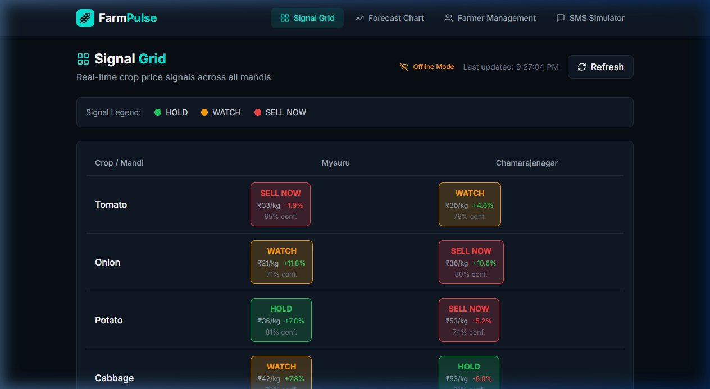
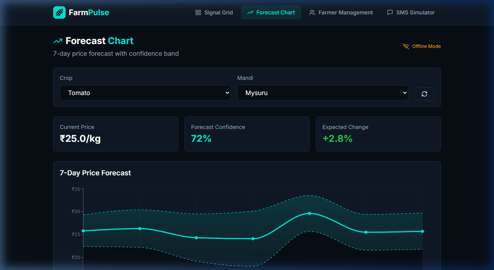
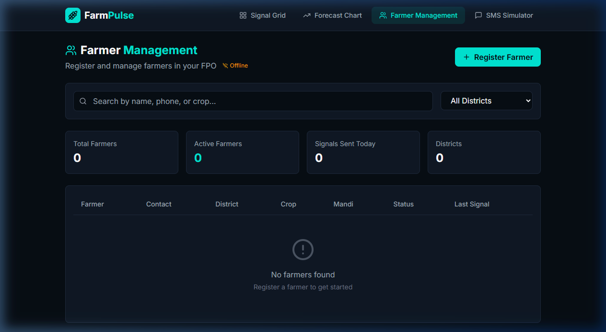
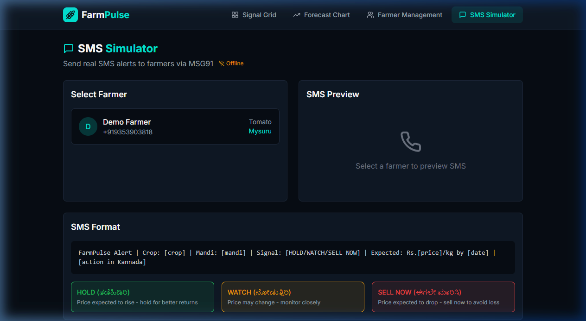

# 🌾 FarmPulse — Predictive Crop Price Intelligence

<div align="center">

**Empowering Karnataka's farmers with AI-driven crop price forecasts and actionable sell/hold signals.**

[](https://python.org)
[](https://fastapi.tiangolo.com)
[](https://reactjs.org)
[](https://tailwindcss.com)

</div>

---

## 📌 Problem Statement

Farmers sell their crops at the wrong market on the wrong day because they have **no forward-looking price data**. A farmer in Chamarajanagar sells tomatoes at ₹18/kg while Mysuru mandi pays ₹40/kg the same day — purely because he didn't know.

**FarmPulse fixes this** by predicting prices **3–7 days ahead** and delivering one simple decision signal: **HOLD**, **WATCH**, or **SELL NOW**.

---

## 🖥️ Screenshots

### Signal Grid
Real-time color-coded crop price signals across all mandis — Green (HOLD), Amber (WATCH), Red (SELL NOW).



### Forecast Chart
7-day ARIMA price forecast with confidence bands for any crop/mandi combination.



### Farmer Management
Register and manage farmers in your FPO with search, filtering, and status tracking.



### SMS Simulator
Preview and send real SMS alerts to farmers via MSG91 in Kannada.



---

## ✨ Features

### Backend (Python + FastAPI + SQLite)

| Feature | Description |
|---|---|
| **REST API** | Signal, forecast, farmer registration, and SMS endpoints |
| **ARIMA Forecasting** | Time-series model predicts crop prices 3–7 days ahead |
| **Signal Engine** | Generates HOLD / WATCH / SELL NOW with confidence % |
| **APScheduler** | Automatic data refresh every 15 minutes |
| **SMS Integration** | MSG91 API for Kannada Unicode SMS delivery |
| **Exotel Webhook** | Handle missed calls from farmers |
| **AgMarkNet Scraper** | Real-time agricultural price data |

### Frontend (React + Tailwind CSS + Recharts)

| Feature | Description |
|---|---|
| **Signal Grid** | Color-coded signal matrix for all crop/mandi pairs |
| **Forecast Chart** | Interactive 7-day price chart with confidence bands |
| **Farmer Management** | Register, search, and manage farmers |
| **SMS Simulator** | Preview and send SMS alerts with Kannada translations |

---

## 🏗️ Project Structure

```
farmpulse/
├── backend/
│   ├── main.py                # FastAPI application & endpoints
│   ├── database.py            # SQLAlchemy database config
│   ├── models.py              # Database models (Farmer, Signal)
│   ├── agmarknet.py           # AgMarkNet price data scraper
│   ├── arima_model.py         # ARIMA time-series forecasting
│   ├── signal_generator.py    # Signal generation logic
│   ├── sms_service.py         # MSG91 SMS integration
│   ├── exotel_webhook.py      # Exotel IVR webhook handler
│   ├── scheduler.py           # APScheduler for auto-refresh
│   ├── .env.example           # Environment variables template
│   └── requirements.txt       # Python dependencies
├── frontend/
│   ├── src/
│   │   ├── pages/
│   │   │   ├── SignalGrid.jsx
│   │   │   ├── ForecastChart.jsx
│   │   │   ├── FarmerManagement.jsx
│   │   │   └── SMSSimulator.jsx
│   │   ├── components/
│   │   │   └── Navbar.jsx
│   │   ├── App.jsx
│   │   ├── main.jsx
│   │   └── index.css
│   ├── index.html
│   ├── package.json
│   ├── vite.config.js
│   ├── tailwind.config.js
│   └── postcss.config.js
├── screenshots/               # UI screenshots
├── docker-compose.yml
├── .gitignore
└── README.md
```

---

## 🚀 Getting Started

### Prerequisites

- Python 3.10+
- Node.js 18+
- Docker & Docker Compose *(optional)*

### Backend Setup

```bash
cd backend
python -m venv venv
source venv/bin/activate        # Windows: venv\Scripts\activate
pip install -r requirements.txt

# Configure environment
cp .env.example .env
# Edit .env with your MSG91, Exotel keys

# Run
uvicorn main:app --reload --port 8000
```

### Frontend Setup

```bash
cd frontend
npm install
npm run dev
# Open http://localhost:5173
```

### Docker Compose (Alternative)

```bash
docker-compose up -d
# Frontend: http://localhost:5173
# Backend:  http://localhost:8000
# API Docs: http://localhost:8000/docs
```

---

## 📡 API Endpoints

| Method | Endpoint | Description |
|---|---|---|
| `GET` | `/signal/{crop}/{mandi}` | Get today's signal for a crop/mandi |
| `GET` | `/signals/all` | Get all signals |
| `GET` | `/forecast/{crop}/{mandi}` | 7-day price forecast |
| `POST` | `/register-farmer` | Register a new farmer |
| `GET` | `/farmers` | List all farmers |
| `GET` | `/history/{farmer_id}` | Farmer signal history |
| `POST` | `/send-sms` | Send SMS alert via MSG91 |
| `GET` | `/health` | Health check |

### Example

```bash
# Get signal for Tomato at Mysuru
curl http://localhost:8000/signal/Tomato/Mysuru

# Register a farmer
curl -X POST http://localhost:8000/register-farmer \
  -H "Content-Type: application/json" \
  -d '{
    "name": "Ramu",
    "phone_number": "+919876543210",
    "district": "Mysuru",
    "primary_crop": "Tomato",
    "preferred_mandi": "Mysuru"
  }'
```

---

## 📱 SMS Format

```
FarmPulse Alert | Crop: Tomato | Mandi: Mysuru | Signal: HOLD | Expected: ₹28/kg by 5 May | ತಡೆಹಿಡಿರಿ - ದರ ಏರಿಕೆ ನಿರೀಕ್ಷೆ
```

### Signal Types

| Signal | Color | Kannada | Meaning |
|---|---|---|---|
| **HOLD** | 🟢 Green | ತಡೆಹಿಡಿರಿ | Price expected to rise — hold for better returns |
| **WATCH** | 🟡 Amber | ನೋಡುತ್ತಿರಿ | Price may change — monitor closely |
| **SELL NOW** | 🔴 Red | ಈಗಲೇ ಮಾರಿಸಿ | Price expected to drop — sell now to avoid loss |

---

## 🤖 AI / ML Pipeline

1. **Data Collection** → Historical prices fetched from AgMarkNet API
2. **Preprocessing** → Cleaning, interpolation, stationarity checks
3. **ARIMA Training** → Auto-selection of (p, d, q) parameters via AIC
4. **Forecasting** → 7-day price predictions with confidence intervals
5. **Signal Generation** → Trend-based HOLD / WATCH / SELL NOW signals

| Forecast Trend | Signal | Confidence Threshold |
|---|---|---|
| Price ↑ > 5% | HOLD | > 70% |
| Price Stable | WATCH | 50–70% |
| Price ↓ > 5% | SELL NOW | > 70% |

---

## 🛠️ Tech Stack

| Layer | Technology |
|---|---|
| **Backend** | FastAPI, SQLAlchemy, SQLite, statsmodels, APScheduler |
| **Frontend** | React 18, Tailwind CSS, Recharts, Vite, Lucide Icons |
| **SMS** | MSG91 API |
| **IVR** | Exotel |
| **Data Source** | AgMarkNet (Government of India) |
| **Containerization** | Docker, Docker Compose |

---

## 🔧 Environment Variables

| Variable | Description |
|---|---|
| `DATABASE_URL` | Database connection string |
| `MSG91_AUTH_KEY` | MSG91 API key for SMS |
| `MSG91_SENDER_ID` | SMS sender ID |
| `EXOTEL_API_KEY` | Exotel API key |
| `EXOTEL_API_SECRET` | Exotel API secret |
| `EXOTEL_VIRTUAL_NUMBER` | Virtual number for IVR |

> See `backend/.env.example` for the full template.

---

## 👥 Team

| Role | Name |
|---|---|
| Team Lead | **AAMINA FIRDOSE** |
| Team Member | **NOOR ANNAM** |

---

## 📄 License

This project is developed for educational and research purposes.
